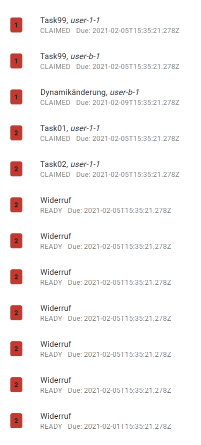

# Task List

This component displays a list of tasks.

<!-- Auto Generated Below -->

## Properties

| Property         | Attribute         | Description                                                                                       | Type     | Default     |
| ---------------- | ----------------- | ------------------------------------------------------------------------------------------------- | -------- | ----------- |
| `orangePriority` | `orange-priority` | This number specifies the priority under which (inclusive) tasks will get a orange badge.         | `number` | `15`        |
| `redPriority`    | `red-priority`    | This number specifies the priority under which (inclusive) tasks will get a red badge.            | `number` | `5`         |
| `selectedId`     | `selected-id`     | The taskId of the currently selected task                                                         | `string` | `undefined` |
| `tasks`          | --                | The list of tasks, that should be displayed. Note, that this component does not limit the length. | `Task[]` | `undefined` |

## Events

| Event              | Description                                                                                      | Type                  |
| ------------------ | ------------------------------------------------------------------------------------------------ | --------------------- |
| `selectedIdChange` | This event gets emitted, when the user selects a task. It emits the taskId of the selected task. | `CustomEvent<string>` |

----------------------------------------------

*Built with [StencilJS](https://stenciljs.com/)*
