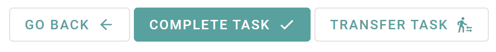

# Task Buttonbar

This component displays a buttonbar, when working on a task.

<!-- Auto Generated Below -->

## Properties

| Property      | Attribute | Description                                                                                                                   | Type           | Default     |
| ------------- | --------- | ----------------------------------------------------------------------------------------------------------------------------- | -------------- | ----------- |
| `task`        | --        | The current Task, this is used to get context for the events                                                                  | `Task`         | `undefined` |
| `workbaskets` | --        | The list of to the user available workbaskets. This is used to provide a dropdown to transfer the task to another workbasket. | `Workbasket[]` | `undefined` |

## Events

| Event           | Description                                                                                                                                                                                             | Type                                                     |
| --------------- | ------------------------------------------------------------------------------------------------------------------------------------------------------------------------------------------------------- | -------------------------------------------------------- |
| `backEvent`     | This event gets emitted, when the user wants to go leave the current page and return to the preview of the task.                                                                                        | `CustomEvent<void>`                                      |
| `completeEvent` | This event gets emitted, when the user marks the current task as completed. It emits the taskId of the completed task.                                                                                  | `CustomEvent<string>`                                    |
| `transferEvent` | This event gets emitted,when the user wants to transfer the task to another workbasket. It emits an object, which contains the taskId and the workbasketId, to which the task should be transferred to. | `CustomEvent<{ taskId: string; workbasketId: string; }>` |

----------------------------------------------

*Built with [StencilJS](https://stenciljs.com/)*
