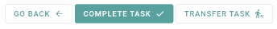

# Task Buttonbar

This component displays a buttonbar, when working on a task.

<!-- Auto Generated Below -->

## Properties

| Property      | Attribute   | Description                                                                                                                   | Type           | Default     |
| ------------- | ----------- | ----------------------------------------------------------------------------------------------------------------------------- | -------------- | ----------- |
| `taskName`    | `task-name` | The name of the current Task                                                                                                  | `string`       | `undefined` |
| `workbaskets` | --          | The list of to the user available workbaskets. This is used to provide a dropdown to transfer the task to another workbasket. | `Workbasket[]` | `undefined` |

## Events

| Event          | Description                                                                                                                                                    | Type                  |
| -------------- | -------------------------------------------------------------------------------------------------------------------------------------------------------------- | --------------------- |
| `back`         | This event gets emitted, when the user wants to go leave the current page and return to the preview of the task.                                               | `CustomEvent<void>`   |
| `completeTask` | This event gets emitted, when the user marks the current task as completed.                                                                                    | `CustomEvent<void>`   |
| `transferTask` | This event gets emitted,when the user wants to transfer the task to another workbasket. It emits the workbasketId, to which the task should be transferred to. | `CustomEvent<string>` |

----------------------------------------------

*Built with [StencilJS](https://stenciljs.com/)*
