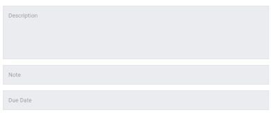

# Task Description

This component displays a short description of the Task, so that the user can understand what this task is about.

<!-- Auto Generated Below -->

## Properties

| Property | Attribute | Description                                                  | Type   | Default     |
| -------- | --------- | ------------------------------------------------------------ | ------ | ----------- |
| `task`   | --        | The task, of which the short description should be displayed | `Task` | `undefined` |

----------------------------------------------

*Built with [StencilJS](https://stenciljs.com/)*
