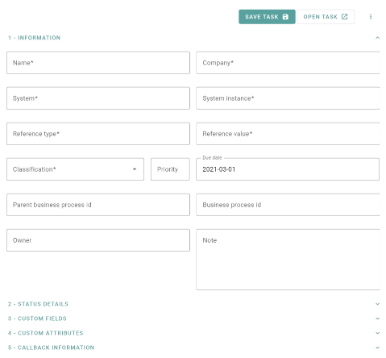

# Task Preview

This component will display all the information a task contains and provides buttons with events to manipulate the task or start working on it.

<!-- Auto Generated Below -->

## Properties

| Property          | Attribute | Description                                                                                                                   | Type                      | Default     |
| ----------------- | --------- | ----------------------------------------------------------------------------------------------------------------------------- | ------------------------- | ----------- |
| `classifications` | --        | The List of classifications, which exist. This is used to show the user a dropdown to specify the classification of the task. | `ClassificationSummary[]` | `undefined` |
| `task`            | --        | The task, which should be displayed                                                                                           | `Task`                    | `undefined` |

## Events

| Event           | Description                                                                                                                                                                                                                                                                                                      | Type                  |
| --------------- | ---------------------------------------------------------------------------------------------------------------------------------------------------------------------------------------------------------------------------------------------------------------------------------------------------------------- | --------------------- |
| `closeEvent`    | This event gets emitted, when the user closes the current Task.                                                                                                                                                                                                                                                  | `CustomEvent<void>`   |
| `deleteEvent`   | This event gets emitted, when the user wants to delete the current Task. It emits the taskId. This component does NOT include a second dialog, which confirms the users choice to delete the task. Please make sure your application includes a PopUp to confirm, if the user actually wants to delete the task. | `CustomEvent<string>` |
| `openTaskEvent` | This event gets emitted, when the user wants to open the task to work on it. It emits the taskId.                                                                                                                                                                                                                | `CustomEvent<string>` |
| `saveEvent`     | This event gets emitted, when the user saves the Task. It emits the Task, that should be saved.                                                                                                                                                                                                                  | `CustomEvent<Task>`   |

----------------------------------------------

*Built with [StencilJS](https://stenciljs.com/)*
