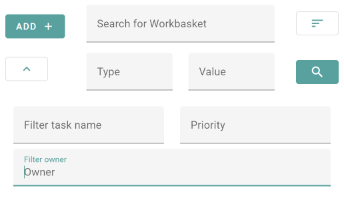

# Task Search

This component is responsible for displaying the filter and sorting options when searching for tasks.

## TaskFilterOptions Properties

| Property       | Description                                       | Type       | Default       |
| -------------- | ------------------------------------------------- | ---------- | ------------- |
| `workbasket-id`| A workbasket id, that specifies the workbasket    | `string[]` | `[undefined]` |
| `por.type`     | The type of the parent object reference           | `string[]` | `[undefined]` |
| `por.value`    | The value of the parent object reference          | `string[]` | `[undefined]` |
| `name-like`    | A string, to specify the name of the task         | `string[]` | `[undefined]` |
| `owner-like`   | A string, to specify the owner of the task        | `string[]` | `[undefined]` |
| `priority`     | The specified priority, that the task should have | `number[]` | `[undefined]` |
| `sort-by`      | A string, which specifies the attribute, which should be used for sorting | `string` | `PRIORITY` |
| `order`        | A string, which specifies the sorting direction   | `string` | `ASCENDING` |
<!-- Auto Generated Below -->

## Properties

| Property      | Attribute | Description                                                                                                                                       | Type           | Default     |
| ------------- | --------- | ------------------------------------------------------------------------------------------------------------------------------------------------- | -------------- | ----------- |
| `workbaskets` | --        | A list of existing Workbaskets, which the user is allowed to access. this list gets used to display a dropdown for easier filtering by Workbasket | `Workbasket[]` | `undefined` |

## Events

| Event              | Description                                                                                                                                                            | Type                             |
| ------------------ | ---------------------------------------------------------------------------------------------------------------------------------------------------------------------- | -------------------------------- |
| `addTaskEvent`     | This event gets emitted, when the "Add" button has been pressed.                                                                                                       | `CustomEvent<void>`              |
| `searchTasksEvent` | This event gets emitted, when a user has pressed the "Search" button. It emits a TaskFilterOptions object, which contains all the parameters for the specified search. | `CustomEvent<TaskFilterOptions>` |

----------------------------------------------

*Built with [StencilJS](https://stenciljs.com/)*
